# Естественные лавинные следы — референсы с вертолётного пролёта 14.08

Библиотека природных следов на снегу с наших же съёмок: как выглядят сходы лавин,
снежных досок, обвалы ледопада и прокаты одиночных кусков. Назначение — калибровка
отсмотра: отличать естественные следы от следа падения/протаскивания человека и не
плодить ложные срабатывания. Смежный рисерч «след падающего человека при лавине»
ведётся отдельно; спутниковая оценка лавинной активности — `avalanche-assessment.md`.

Источник: вертолётный пролёт 14.08, `data/drive/2026-08-14/vertolet-saykal/`.
Таймкоды и описания — от волонтёров-отсмотрщиков (пересланы в чат 14.08).
Кадры: `lavinnye-sledy/<клип>_<ммсс>.jpg`, извлечены ffmpeg по этим таймкодам.

## C0018 — обвал ледопада

**1:30** — в левом нижнем углу следы обвала ледопада (аналогично фото Саши Мурановой).
На кадре: разломанные сераки, обнажённые тёмные скалы в центре, снежная крошка
конусом внизу слева. Характер следа — хаос крупных блоков, не линейный.

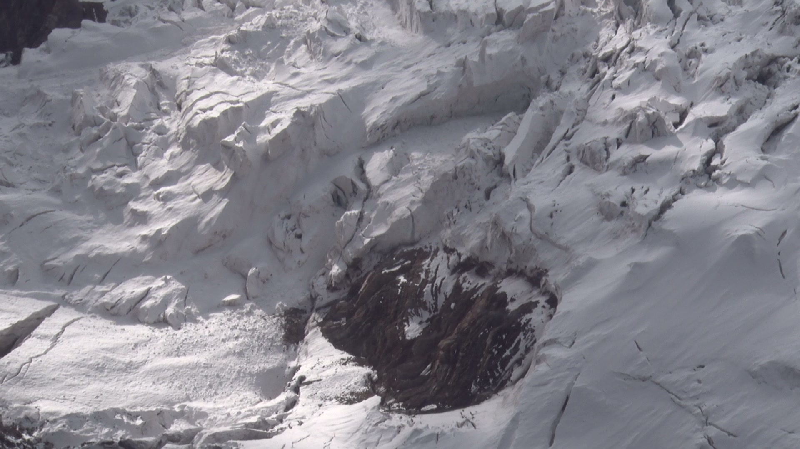

## C0019 — фоновые естественные неровности

**0:07** — естественный гребень от сошедшего снега: пологие «потёки» по линии склона,
без чёткой борозды. **0:25** — естественная неровность рельефа под снегом.
Оба кадра — образец «чистого» склона, на котором любая узкая линейная борозда
выделялась бы сразу.

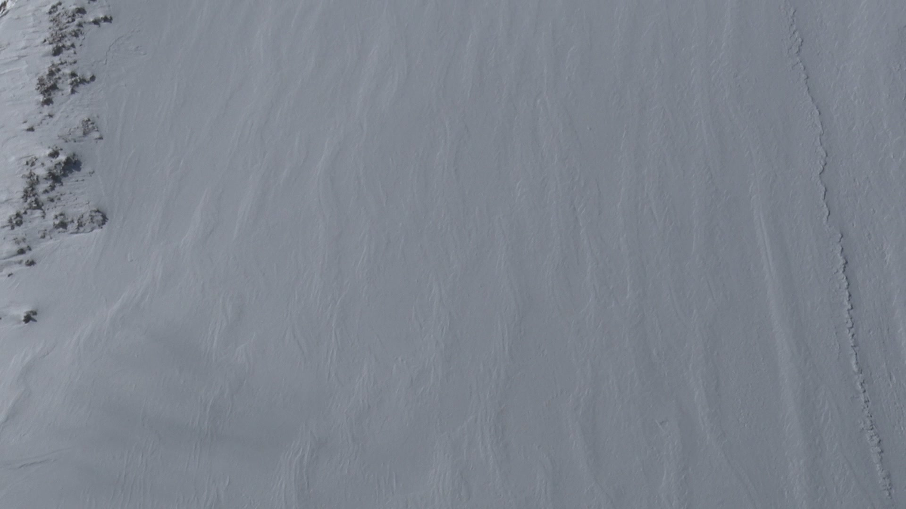

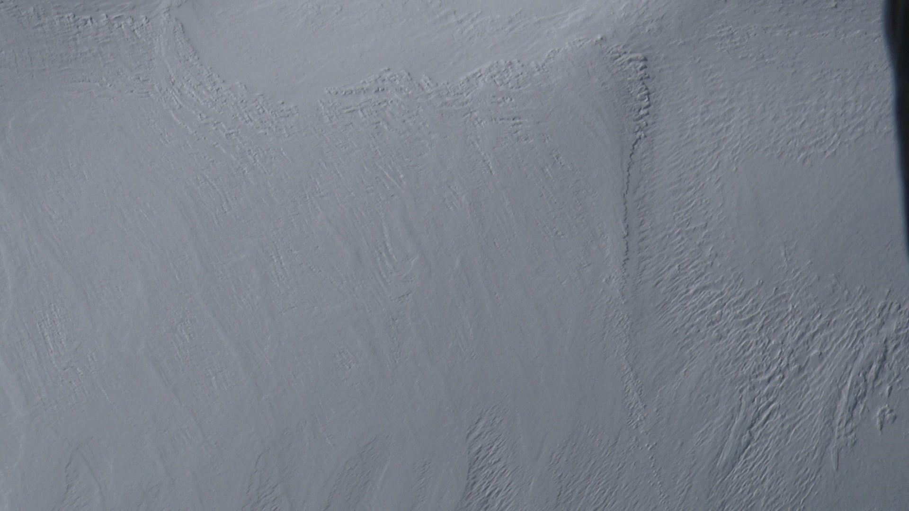

## C0020 — микролавины и прокат одиночного куска

**0:14** — микролавина сошла и остановилась сама на склоне: серое матовое пятно-язык
слева от скал, границы размытые. **0:26** — она же с другого ракурса (отложение
в правой нижней части кадра у подножия скал).

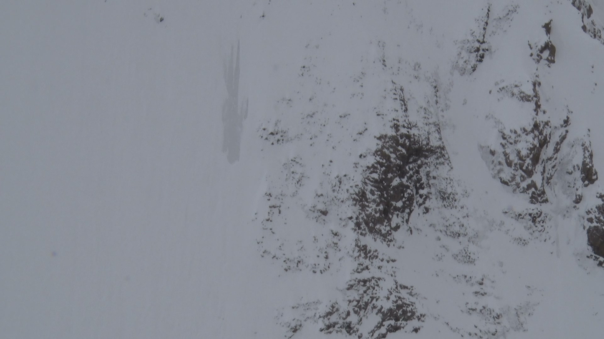

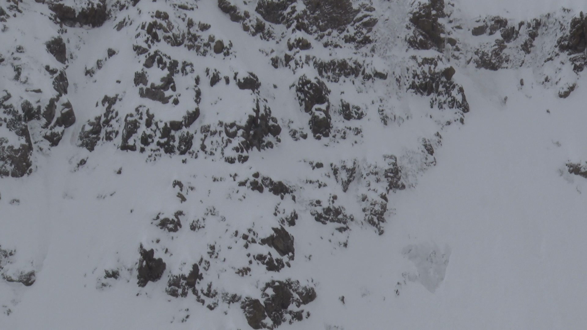

**1:57 — ключевой референс.** Самостоятельный срыв маленького куска: прокат по склону,
заваливание набок, остановка. На кадре видна пунктирная борозда от скачков куска вниз
по линии падения и сам кусок в конце следа. Это ближайший природный аналог того,
как может выглядеть след скатывания компактного объекта массой порядка десятков кг —
эталон для сравнения при поиске следа человека.

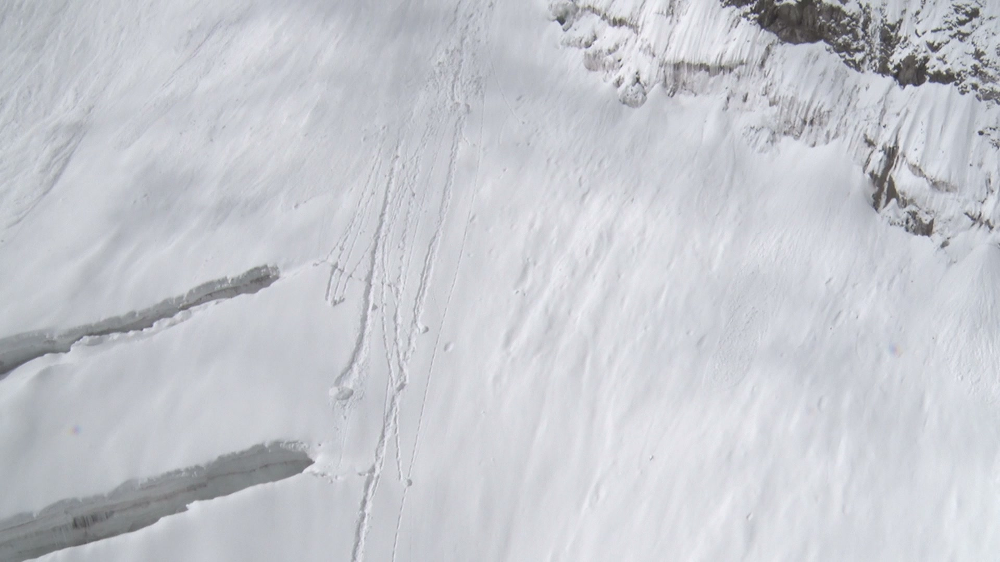

**3:27** — следы сходов трёх лавин: полосы уплотнённого снега на крутом взлёте над
стеной сераков. **3:47** — в левом верхнем углу свежая лавина (комковатое отложение),
по центру сверху — припорошенная снегом старая.

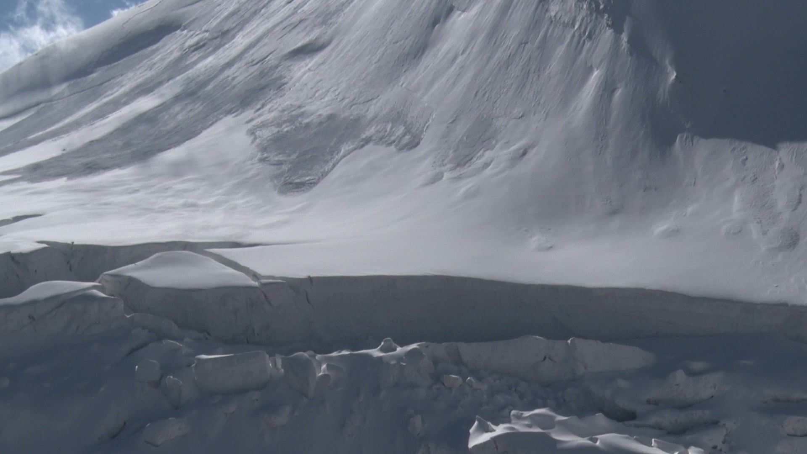

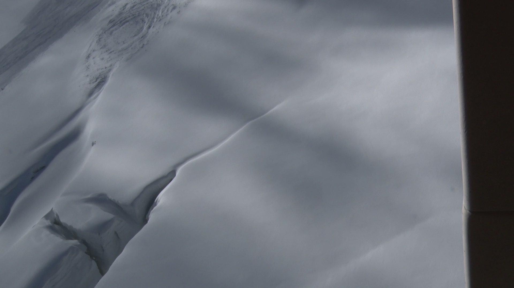

## C0023 — массовые сходы на пологом склоне

**1:46–1:59** — следы схода свежих лавин. Склон более пологий, чем наш: снег дольше
накапливается, но при сдвиге съезжает заметно большая масса. На 1:46 — широкий язык
отложения с комковатой текстурой; 1:53 и 1:59 — граница сошедшей массы и нетронутого
снега крупным планом.

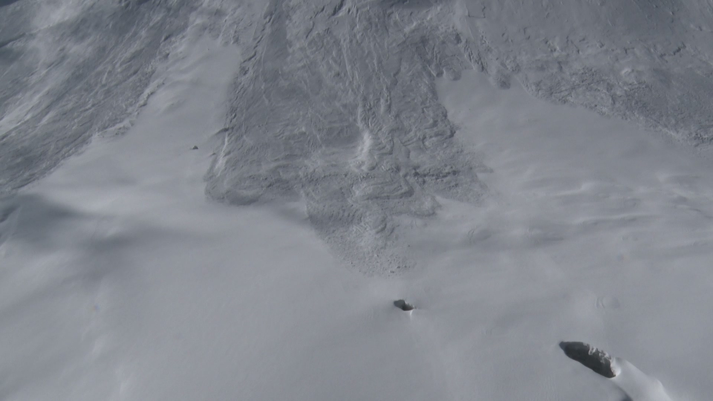

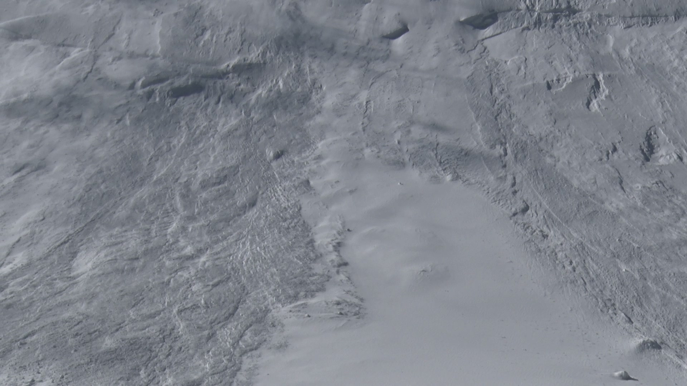

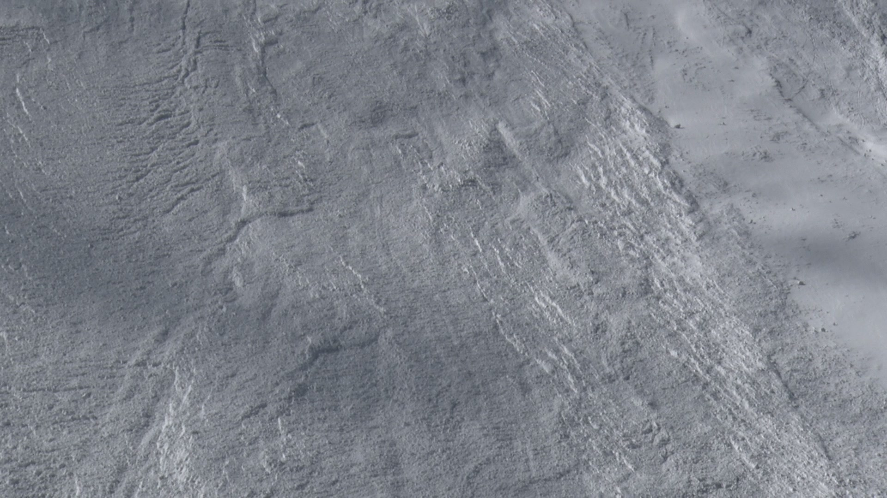

## C0028 — крутой склон: мелкие сходы, слои, снежная доска

**1:01** — в правой трети кадра два следа схода (камень? снег?) — диагональные линии
**не по линии падения воды**. Важный маркер: естественные сходы обычно строго по линии
падения; отклонение — повод присмотреться.

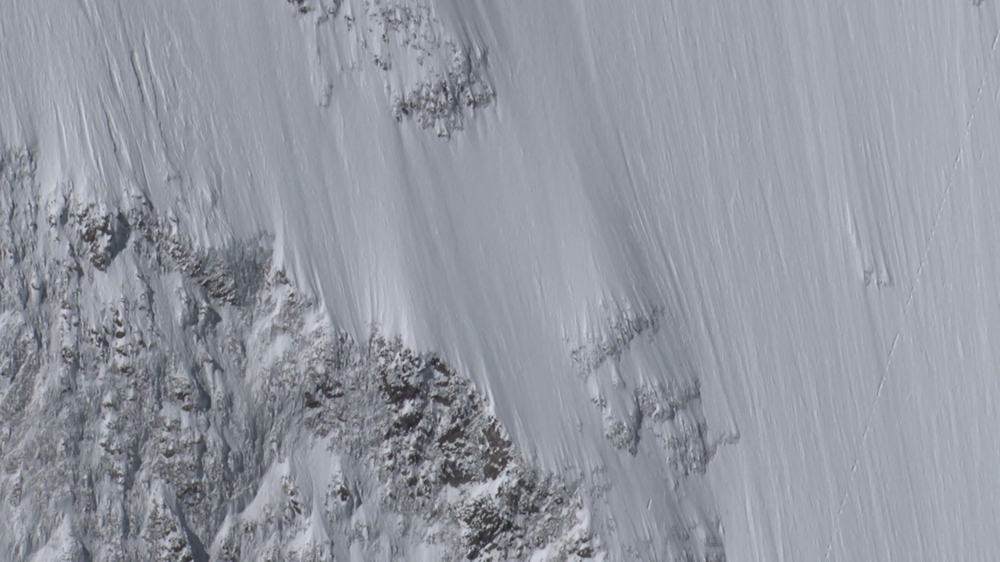

**1:17** — припорошенные следы сходов на крутом склоне: большая масса тут не
накапливается, сходит малыми объёмами. Из-за слоистости толщи (выпал — подтаял —
выпал снова) снег часто сходит слоями, «снежной доской». В левой части кадра — след
схода узкой длинной доски; в центре — возможный отрыв небольшой части карниза.

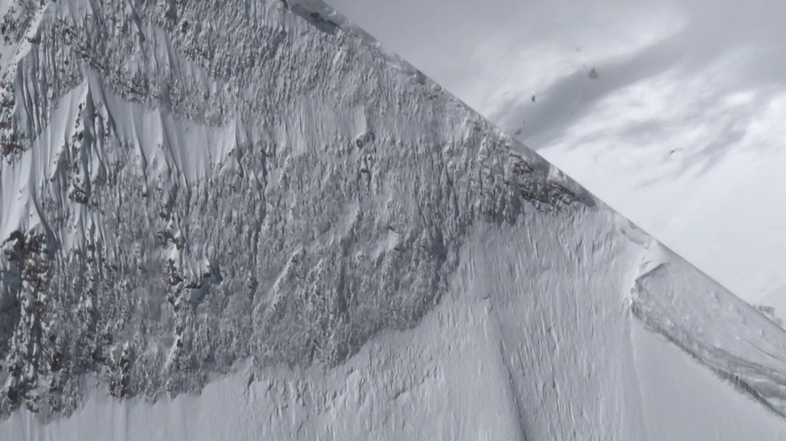

## C0029 — полосы свежего снега на старом

**1:13** — свежий снег не удерживается на старом и образует узкие, более гладкие
полосы по линии склона. Не путать с бороздами от проката объекта: полосы широкие
у истока, без пунктира и без тела-остановки в конце.

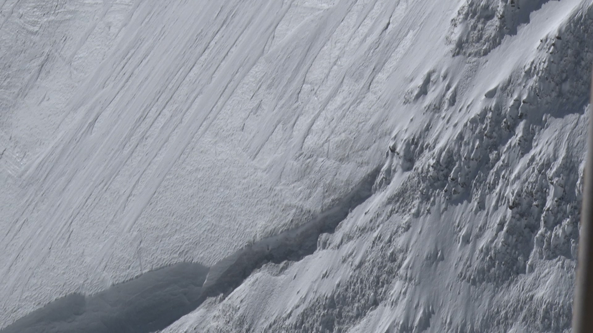

## C0030 — классическая снежная доска

**0:12** — классический сход снежной доски, причём двух: тонкой почти по всей площади
кадра и толстой в центральной части (виден ступенчатый отрыв под карнизом). Возможно,
сход массивной центральной части спровоцировал сход тонкого слоя слева.

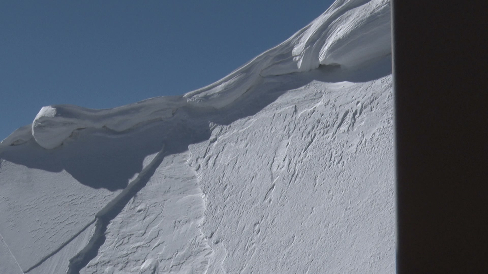

## Выводы для отсмотра

- След проката одиночного компактного объекта (C0020 1:57): узкая пунктирная борозда
  строго по линии падения + объект в конце. Именно такую сигнатуру искать для человека.
- Массовые сходы (C0023, C0030) дают широкие языки и ступени отрыва — с бороздой
  не спутать.
- Полосы свежего снега на старом (C0029) и потёки (C0019) — частый источник ложных
  линейных «следов»: у них нет точки остановки и пунктира.
- Следы не по линии падения воды (C0028 1:01) — редкость для природы, кандидат
  на внимательный отсмотр.
