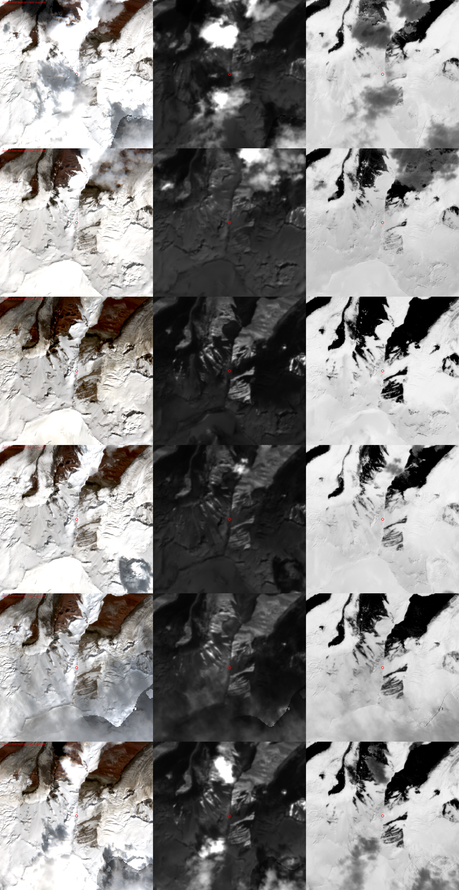

# Мониторинг осадков и прироста снега на Курумды

Обновлено: 2026-08-27. Ответ на задачу штаба: «в преддверии третьего этапа нужно мониторить
количество осадков на горе — дёшево; идея: купить спутниковые снимки и оценивать прирост
снега компьютерным зрением».

Точка интереса: склон под Camp2, 39.476 N 73.592 E, пояс 5385–5485 м (зона интереса),
лагеря ABC 4049 / C1 5018 / C2 5529 / C3 6062 м.

Подробные отчёты по каждому направлению (цены, ссылки, латентности, статьи) лежат в
[osadki-monitoring/otchety/](osadki-monitoring/otchety/):

| # | Отчёт | Что внутри |
|---|---|---|
| 01 | [Открытые спутниковые данные](osadki-monitoring/otchety/01-otkrytye-sputnikovye-dannye.md) | Sentinel-2/1, Landsat, MODIS/VIIRS, снежные продукты, геостационары, Planet E&R — с фактическими ревизитами и латентностями над точкой |
| 02 | [Коммерческие снимки](osadki-monitoring/otchety/02-kommercheskie-snimki.md) | Planet/SkySat, Vantor, Airbus Pléiades, Satellogic, SkyFi/UP42/EOSDA/SkyWatch, Jilin, Терра Тех, SAR — прайсы, минимальные заказы, стерео |
| 03 | [Метеомодели и прогнозы](osadki-monitoring/otchety/03-meteo-modeli-prognozy.md) | ERA5, IFS 9 км, GFS/ICON, ансамбли, IMERG, Open-Meteo API (готовые URL), mountain-forecast/meteoblue, валидация в Памире |
| 04 | [Наземные датчики и дроны](osadki-monitoring/otchety/04-nazemnye-datchiki-drony.md) | Рейки + фотоловушки, ультразвуковые снегомеры + Iridium, осадкомеры, Starlink в КР, дрон-SfM, LiDAR, реперы |
| 05 | [Станции и наблюдатели региона](osadki-monitoring/otchety/05-stantsii-regiona.md) | Каракуль 38875, Сары-Таш 38871, сеть CAWa/GFZ, Кыргызгидромет, Ак-Сай, климатология Заалая |
| 06 | [Компьютерное зрение](osadki-monitoring/otchety/06-computer-vision.md) | Стерео-DEM, NDSI/SWIR/снеговая линия, SAR, ICESat-2, дрон-dDEM, чтение реек, VLM — точности по статьям и готовый код |

---

> **Как это реализовано (код, конвейер, агент, страницы, запуск, отладка)** — отдельный справочник
> [osadki-monitoring/realizatsiya.md](osadki-monitoring/realizatsiya.md). Этот файл — научная база и история
> решений; §7–8 — уточнённый интент и что построено 28.08.

## 1. Главный вывод (коротко для штаба)

1. **«Купить снимки + компьютерное зрение» цифру «сколько выпало» не даст.** Оптический
   снимок любого разрешения видит только *факт* свежего снега, снеговую линию и лавинные
   выносы. Сантиметры прироста из космоса дают только **стерео-съёмки в двух датах**
   (Pléiades/WorldView/SkySat стерео, от $3–6 тыс. за захват при минимуме 50–100 км²) с
   ошибкой ±0,5–0,7 м на пиксель и до ±1,5 м на склонах круче 45° — то есть они отличат
   «намело метр», но не «намело 30 см». Ни одного бесснежного эталона рельефа для этой горы
   нет (снег выше 5000 м всегда), поэтому нужны *две* покупки.
2. **Факт снегопада и его «размах» бесплатно и уже сейчас даёт Sentinel-2** (10 м, каждые
   2–3 дня, снимок доступен через 3–8 ч). Проверено на августе: индекс «доля открытой скалы
   на склоне под Camp2» проседает после каждого снегопада (см. §3). Покупать оптику ради
   этого не нужно.
3. **Сантиметры на конкретном месте дают только наземные и дроновые методы:**
   повторная фотограмметрия того же склона дроном (±10–25 см), снегомерная рейка/реперы на
   фото (±2–10 см), автономный ультразвуковой снегомер со спутниковой передачей (±1–3 см,
   ~$1 000–1 300 за узел + ~$25/мес).
4. **Модельные осадки (ERA5, ECMWF, GFS, ICON…) на высоте 5500 м расходятся в разы**:
   за август для Camp2 разные модели дают от 11 до 105 см снега (см. §3). Как ежедневный
   бесплатный «светофор» и прогноз они годятся, как измерение — нет; их нужно калибровать
   по наземному факту.
5. Ближайшая действующая метеостанция с осадками — **Каракуль (Таджикистан, 3930 м, 52 км
   южнее)**, сводки каждые 3 ч через OGIMET. Сары-Таш (3150 м, 40 км) отдаёт явления
   («снег») и облачность, но суммы осадков — только по запросу в Кыргызгидромет, который
   входит в МЧС КР, то есть штаб может получить их по ведомственной линии.

Рекомендуемый план — в §5: бесплатный ежедневный бюллетень запускается за 1 день, наземная
часть ставится при заброске третьего этапа, покупки — только событийные.

---

## 2. Что вообще можно измерять и чем

Задачу «мониторить осадки» стоит разложить на три разных вопроса — у них разные источники:

| Вопрос | Что нужно | Кто отвечает | Точность |
|---|---|---|---|
| **Был ли снегопад, когда, насколько сильный** (для планирования вылетов и этапа) | событие да/нет, дата, порядок величины | Sentinel-2 (индекс скал, SWIR-«свежесть»), VIIRS/MODIS ежедневно, Elektro-L каждые 30 мин, ECMWF/ансамбль, Каракуль/Сары-Таш | событие ≥1 см ловится в 77–91 % случаев (оптика); дата ±1 день |
| **Сколько выпало / накопилось на высоте 5000–5500 м** (мм в.э., см снега) | измерение | только наземные: рейка, ультразвуковой снегомер, тотализатор; модели — лишь оценка ×1,5–2 | ±1–3 см (датчик), ±5–10 см (рейка на фото); модели ±100 % |
| **Насколько занесло конкретное место** (зона интереса, предметы) | изменение высоты поверхности в точке | повторная дрон-SfM, фото реперов, заметённость предметов известного размера; спутниковое стерео — только при ≥1 м | 10–25 см (дрон), 5–10 см (предметы/реперы), 0,5–1,5 м (стерео) |

Важная физика: на склонах 30–50° прирост *поверхности* ≠ *снегопад* — свежий снег сползает,
сдувается, оседает на 20–50 % за дни. Для штаба нужна именно первая величина («насколько
занесло»), и формулировать задание наблюдателям стоит так.

---

## 3. Что проверено эмпирически сегодня (27.08)

### 3.1 Sentinel-2 над точкой — доступность и «индекс скал»

Каталог Copernicus за 16.07–27.08: **22 сцены L2A**, две орбиты (R048 ~05:46 UTC, R091
~05:56 UTC, т.е. ~11:50 местного), три спутника S2A/B/C → сцена каждые 2–3 дня; публикация
через 3–8 ч после съёмки. В августе безоблачных над самой площадкой — 8 из 14.

Sentinel-1: только S1D, **4 прохода за 12 дней** (два восходящих, два нисходящих), публикация
через 2–3 ч. S1C над районом в каталоге пока нет.

Кропы RGB / SWIR (B11) / NDSI над зоной ~3×3 км (красный кружок — Camp2), даты 05.08, 15.08,
20.08, 25.08, 27.08, 17.08 сверху вниз:

Ряд «доля пикселей NDSI < 0,4 (скала/морена)» в окне 600×600 м на склоне под Camp2, только
безоблачные пиксели по маске SCL (скрипт [rock_ts.py](osadki-monitoring/rock_ts.py)):

| Дата | Доля скалы | Комментарий |
|---|---|---|
| 02.08 | 30 % | сухо, скалы открыты |
| 05.08 | **5 %** | после снегопада 03–04.08 (все модели дают 04.08 максимум месяца) |
| 07.08 | 14 % | сдуло/стаяло с камней |
| 15.08 | **8 %** | после снега 10–12.08 и события 14.08 (сорвало облёт) |
| 17.08 | 16 % | |
| 20.08 | 18 % | сухая неделя |
| 25.08 | **8,5 %** | после снегопада 22–23.08 |
| 27.08 | 18 % | |

Вывод: индекс — рабочий **детектор снегопадов** (падает после каждого события, за 2–5 дней
восстанавливается, потому что тонкий свежий снег на солнечных камнях быстро уходит). Про
*накопление* он не говорит. Для «свежести» снега дополнительно годится яркость в B11 (SWIR):
свежий мелкозернистый снег ярче, старый фирн темнее (в отчёте 06 — метод по Kokhanovsky 2021,
детекция снегопада от ~1 см).

### 3.2 Модели: август для Camp2 (elevation = 5529 м)

Суточные суммы снега (см) по Open-Meteo, архив оперативных прогнозов (`historical-forecast-api`)
и ERA5; полная таблица по дням — [modeli-avgust-2026-camp2.tsv](osadki-monitoring/modeli-avgust-2026-camp2.tsv),
итог за 01–27.08:

| Модель | Σ снега за август, см | 04.08 | 14.08 | 22.08 |
|---|---|---|---|---|
| ERA5 (до 12.08) + IFS 9 км (после)* | 28 | 9,0 | 0,4 | 4,3 |
| ECMWF IFS 0.25° | 24 | 4,4 | 0,2 | 5,2 |
| GFS | 53 | 7,9 | 1,2 | 8,0 |
| ICON | 30 | 0,6 | 0,4 | 4,2 |
| JMA | 41 | 15,8 | 0,1 | 2,0 |
| Météo-France ARPEGE | 11 | 4,2 | 0,1 | 2,0 |
| UKMO | 105 | 11,6 | 4,1 | 12,2 |

\* Open-Meteo `archive` без параметра `models` отдаёт ERA5 только до 12.08 (лаг ~15 дней), дальше
подставляет IFS 9 км — в одном ряду два разных «климата», для накопительных сумм брать один
источник (рекомендация отчёта 03: `models=ecmwf_ifs`).

Выводы: (а) **разброс ×10** между моделями — цифры без наземной привязки не годятся;
(б) события 03–04.08, 10–12.08, 21–23.08 видят все модели и подтверждает Sentinel-2;
(в) снегопад 14.08, сорвавший облёт, модели дают на уровне 0,1–1 см (UKMO — 4 см): либо
локальное конвективное событие, либо облёт сорвала видимость, а не количество. Бюллетень
должен показывать и осадки, и низкую облачность/видимость, и вести журнал «факт vs модель».
Соотношение snowfall/precipitation у Open-Meteo фиксировано 7:1; для −10…−20 °C реальный
свежий снег 10:1–20:1 — пересчитывать из мм в.э. самим.

Из литературы (отчёт 03): ERA5 занижает снегопад на 5000 м в Высокой Азии в ~1,4–1,8 раза,
при этом в сумме по бассейнам завышает (размазывает по ячейке); IMERG/GSMaP для твёрдых
осадков на 5000 м — «deficient» по словам самой NASA. Snow depth из ERA5-Land над ледником —
артефакт (константа 20 м).

---

## 4. Сводная карта вариантов

Оценка 1–5 — пригодность для задачи *этой* операции (не вообще). Подробности — в отчётах.

### 4.1 Бесплатные спутниковые данные

| Источник | Разр. | Ревизит (факт) | Латентность | Что даёт для задачи | Оценка |
|---|---|---|---|---|---|
| **Sentinel-2 L2A** (CDSE / Sentinel Hub 10 000 PU/мес / AWS COG) | 10–20 м | 2–3 дня | 3–8 ч | индекс скал, снеговая линия, SWIR-свежесть → *детектор событий* | **5** |
| Sentinel-1 GRD | ~20 м | 4 прохода/12 дн | 2–3 ч | мокрый/сухой снег сквозь облака; глубина — нет (склон 46° в layover/тени, сигнал < шума) | 3 |
| Landsat 8/9 | 30 м | 8 дней | 4–6 ч | +1 шанс на ясную сцену в неделю | 3 |
| VIIRS / MODIS (LANCE NRT) | 375–500 м | ежедневно ×3 | 1–3 ч | «был снегопад в районе», альбедо | 3 |
| NASA Worldview/GIBS | 250 м | ежедневно | ~3 ч | визуальный контроль без кода | 4 |
| Elektro-L №3/№5 (76° в.д.) | ~1 км | 30 мин | минуты–часы | когда облачно / когда просветы, планирование вылетов | 3 |
| Meteosat-9 IODC | ~5 км | 15 мин | ~1 ч | то же, калиброванное | 3 |
| Planet E&R (нужен университетский e-mail) | 3 м | ежедневно | часы | лучший визуальный ряд, 3 000 км²/мес бесплатно | 4 / 0 |
| CLMS SCE 1 км, H SAF, CLMS SWE 5 км, ESA CCI, HMASR, ICESat-2, Umbra/Capella open | — | — | — | насыщено/архив/нет сцен/раз в 3 года | 0–2 |

### 4.2 Коммерческие снимки (площадка 4 км², но платить за минимум 10–100 км²)

| Канал | GSD | Чек за один снимок | Стерео | Комментарий | Оценка |
|---|---|---|---|---|---|
| **SkySat flexible через Planet Select (SkyFi)** | 50 см | **$300** (25 км²), assured $1 000 | только по контракту | гарантия облачности ≤15 %, перезаказ бесплатно, оплата картой | **4** (событийно) |
| Satellogic (EOSDA / Aleph) | 70→50 см | архив $64–72 за тайл 16 км²; tasking ~$120–250 | нет | самый дешёвый новый снимок | 3 |
| SkyWatch EarthCache | 50 см | заявлено от 1 км² → $48–60 (проверить в приложении) | Pléiades стерео заявлено $36/км² от 1 км² — **если правда, $150–350 за стерео** | единственный канал без минимума 100 км² | 3 (проверить) |
| Vantor (WV-3/Legion) через UP42 | 30 см | ≈€560 (25 км²) | да (Apollo $3 250 / 50 км²) | лицензия запрещает ML-обучение | 2–3 |
| Airbus Pléiades / Neo (Apollo, OneAtlas) | 50 / 30 см | mono $2 125 / $3 250; **стерео $3 625 / $6 375**; tri-stereo $6 250 / $8 250 (100 км²) | tri-stereo — стандарт снежных DEM | точность на снегу NMAD 0,4–0,7 м, на >45° до −1,5 м | 3 (если нужны метры по всей стене) |
| PlanetScope подписка | 3 м | $2 700/год (50 км²) | нет | ежедневно, но Sentinel-2 даёт почти то же бесплатно | 2 |
| Jilin-1, KOMPSAT, SuperView, BlackSky, Soar, Терра Тех (₽) | 30 см–1 м | $200–2 500 | частично | альтернативы, без явных преимуществ; Терра Тех — оплата в рублях, мин. ~30 тыс ₽ | 2 |
| SAR Umbra / ICEYE / Capella | 25 см–1 м | $675–900 за сцену | нет | сквозь облака, лавинные выносы; глубину не измеряет | 2 |

Региональных запретов на съёмку/продажу Кыргызстана/Таджикистана ни у кого не найдено
(китайские аппараты не продают только на Китай/КНДР/Иран). AOI не заводить на территорию
Китая.

### 4.3 Метеомодели и прогнозы (бесплатно, готовые URL в отчёте 03)

| Источник | Что даёт | Оценка |
|---|---|---|
| **Open-Meteo `ecmwf_ifs` 9 км, `elevation=5529`** | прогноз 15 дн + `past_days` «что выпало» + архив прогнозов с 2017 | **5** |
| **Open-Meteo Ensemble `ecmwf_ifs025` (51 член)** | P(снег ≥1 см / ≥5 см) по дням | **5** |
| GFS / ICON / UKMO / ARPEGE / AIFS | вилка моделей; freezing level (GFS, ICON; у ECMWF null) | 4 |
| mountain-forecast.com **Gora Kurumdy** (4000/5000/6000/6614 м) | человекочитаемо, бесплатно 6–7 дн | 4 |
| meteoblue point+ (€10/мес) | Meteogram Snow по высотам, 14 дн | 4 |
| ERA5 / ERA5-Land / MERRA-2 / HAR v2 | лаг 5–20 дней; для климатологии «какой сентябрь обычно» | 2 / 4 |
| IMERG / GSMaP / CHIRPS / MSWEP | твёрдые осадки на 5000 м не видят | 1–2 |

### 4.4 Реальные наблюдения в регионе

| Источник | Где | Что | Оценка |
|---|---|---|---|
| **Каракуль, WMO 38875** (OGIMET, каждые 3 ч) | 3930 м, 52 км Ю | осадки, явления, зимой снег | **5** |
| **Сары-Таш, WMO 38871** (OGIMET, rp5) | 3150 м, 40 км СЗ | явления «снег», облачность, видимость; суммы — только через Кыргызгидромет | 4 |
| **Кыргызгидромет через МЧС КР** (synop@meteo.kg, +996 312 31-46-88) | — | полные данные Сары-Таш, спецпрогноз на 5000–6000 м | 4 |
| Ак-Сай Трэвел, Ачик-Таш / лагерь 4400 м (Starlink, WhatsApp +996 770 901 616) | 55 км З | живой наблюдатель, пока лагерь работает (сентябрь) | 4 |
| Погранзаставы Бордобо / Кызыл-Арт (22 км), Иркештам | 3200–4280 м | словесно «снег на северном склоне: да/нет» | 3 |
| Сеть CAWa/GFZ–CAIAG (SARY 3136 м, ALA6 3628 м, Абрамова 4124 м) | 42–174 км | осадки без снегомера; публично — помесячно, real-time по запросу в CAIAG | 3 |
| Вебкамеры, TG-каналы погоды района | — | не найдены | 0 |

Осторожно с индексами: `38869` — Ирхт, не Сары-Таш; `38744` — теперь Ляхш, станция Маркансу
(4267 м, 30 км от горы) закрыта. Ближе 40 км действующих станций нет.

Климатология (отчёт 05, экстраполяция от Абрамова и Федченко): сентябрь в Заалае — один из
самых сухих месяцев, устойчивое накопление с октября; на 5000–5500 м за сентябрь–октябрь в норме
ориентировочно 10–25 см в.э. ≈ 30–100 см свежего снега, один активный циклон — 20–50 см за
1–2 суток. Порядок величины, не норма.

### 4.5 Наземные и дроновые методы

| Вариант | Точность | Цена | Готовность | Оценка |
|---|---|---|---|---|
| **Фото скальных реперов с фиксированных точек** (выбрать 6–10 камней по ортофото, замерить высоту сейчас по SfM/дальномеру) | ±10–20 см | $10 | 1 день | **5** по цене |
| **Рейки 3 м + фотоловушка time-lapse** на ABC/C1 (чтение — NRCan snow-depth / snowpoles, MAE 1,3 см) | 1–2 см (человек), 3–9 см (авто) | $150–550 | 1–3 дня | 4 |
| **Автономный узел: ESP32 + MaxBotix MB7354 + RockBLOCK 9603N/9704 (Iridium)**, первичные литиевые батареи (Cryologger-подход) | ±1–3 см, 1–4 отсчёта/сут | $900–1 300 + $22–30/мес | 1–2 недели (доставка модема) | **5** |
| inReach-пресеты у спасателей («ABC snow XX см») | 5–10 см | $15/мес | 1 день | 4 |
| Starlink KG-комплект в лагере с людьми (в КР с 25.05.2026) | фото рейки ежедневно | ~$450 + $62/мес | — | 3 |
| Тотализатор с антифризом (+HX711 на том же модеме) | ±30–50 % недолов | $50–500 | 2 дня | 3 |
| **Повторная дрон-SfM по сохранённой waypoint-миссии** (80/70 % перекрытие, GSD 3–5 см, косо под склон, низкое солнце; совмещение по скалам через xdem) | ±10–25 см + карта надувов/выдувов | 0 при наличии дрона | 1 день на маршрут, 2–4 дня на пайплайн | **4** |
| Дрон-LiDAR (Zenmuse L2), Swarm, Sateliot/Lacuna, Pluvio | — | дорого / мёртво / не в КР | — | 1–2 |

Ограничение дронов: Mavic 3E/Matrice 4E — потолок 6000 м, M350 с винтами 2112 — 7000 м; на
5500 м время полёта 15–20 мин.

### 4.6 Компьютерное зрение — что реально измеримо

| Метод | Даёт | Точность (по статьям) | Код | Оценка |
|---|---|---|---|---|
| S2: индекс скал + снеговая линия + SWIR/SSA-разность | событие да/нет, ΔSLA м/нед | событие ≥1 см: recall 77–91 %; SLA ±10–20 м | GEE-скрипты (Zenodo), glacier-snow-cover-mapping, наш rock_ts.py | 4 (событие) / 1 (глубина) |
| Спутниковое стерео ×2 даты → dDEM | Δh поверхности, м | NMAD 0,4–0,7 м; на >45° до −1,5 м; дыры на пересвеченном снегу 17–23 % | NASA ASP, skysat_stereo, xdem | 3 |
| Sentinel-1 (spicy-snow, Lievens) | «глубина» 100 м–1 км | RMSE 0,92 м, R 0,46; <1,5 м не видит | spicy-snow | 1 (глубина) / 3 (мокрый снег) |
| ICESat-2 | Δh по треку | NMAD 1,5 м на 30–40°, один трек раз в ~3 года | SlideRule | 1 |
| Дрон-SfM до/после (старые COLMAP-сцены как «до») | Δh, см–дм | 5–30 см с GCP; 0,2–0,5 м по скалам без GCP | ODM/COLMAP + xdem NuthKaab | 4 |
| Чтение реек / реперов на фото | см у рейки; м на склоне | 1,3 см (snowpoles); 0,1–1 м по дальности | snowpoles, PRACTISE, наш геопроектор луча | 4 |
| Заметённость предметов известного размера, «rock exposure» по ортофото между облётами | дм у объекта; м по DEM | ±5–10 см; ±0,3–0,5 м | свой код | 3 |
| VLM (Claude и др.) | отсев облачных сцен, качественно «свежий/старый», чтение рейки | без метрики | — | 2 (сортировщик, не измеритель) |

Честный итог по идее штаба: **купленные моно-снимки дают то же, что бесплатный Sentinel-2;
цифры дают стерео (±0,5–1 м, одноразово) или дрон/рейки (сантиметры, локально).**

---

## 5. Рекомендуемый план

### Уровень 0 — запустить сейчас, бесплатно, 1–2 дня работы

1. **Ежедневный бюллетень в TG штаба** (cron на нашей стороне, режим приватности — тим-версия):
   - Open-Meteo `ecmwf_ifs`, `elevation=5529`: «за вчера X мм в.э. (≈Y см свежего при T),
     прогноз 7 дней, T min/max, ветер, низкая облачность»; вилка GFS/ICON + freezing level;
     ансамбль ECMWF → P(≥1 см), P(≥5 см); «накоплено с 15.08: Z мм в.э.» из одного источника.
   - Светофор: зелёный <1 мм, жёлтый 1–5, красный >5 мм/сут или ветер >15 м/с. Пороги
     консервативные: ложная тревога дёшева, пропуск — нет.
   - Каракуль 38875 и Сары-Таш 38871 из OGIMET каждые 3 ч (коды WW 70–79, 85–86 = снег,
     осадки Каракуля, облачность, видимость).
   - Журнал `дата — ECMWF/GFS/ICON — факт от штаба/дрона/наблюдателя` для калибровки.
2. **Sentinel-2 «индекс засыпания»** по новой сцене (каждые 2–3 дня, к 15–17 ч местного):
   доля скал по высотным поясам, SWIR-свежесть, снеговая линия в долинах + PNG-квиклук с
   обводкой зоны C2–C3 в тим-версию. Прототип уже есть (§3.1).
3. **Worldview/GIBS + Elektro-L** квиклуки: район целиком, облачность, окна для вылетов.
4. Закрепить в чате ссылки mountain-forecast Gora Kurumdy 5000/6000 м.
5. **Официальный запрос от штаба в Кыргызгидромет** (по линии МЧС): срочные данные Сары-Таш с
   осадками и снегом, спецпрогноз для 5000–6000 м; через МЧС КР в Таджикгидромет — полные
   сводки Каракуля. Написать CAIAG/GFZ про real-time доступ к SDSS (данные и так CC-BY).

### Уровень 1 — при заброске третьего этапа, $200–500

1. **Реперы**: по ортофото выбрать 6–10 камней в зоне 5385–5485 м и у C2/C1/ABC, замерить
   высоту над снегом сейчас (SfM / дальномер дрона / рулетка), завести карточку «репер →
   эталонное фото → высота». Протокол для вертолёта/дрона: те же точки, тот же зум, hover-фото.
2. **Две рейки 3 м + фотоловушка** на ABC (и рейка на C1): time-lapse раз в 1–3 ч, литиевые AA.
3. **inReach-пресеты** у спасателей: «ABC snow XX / C1 snow XX / снегопад да-нет».
4. Попросить Ак-Сай (пока лагерь жив) о ежедневном фото/сообщении со снеговой линией.
5. **Дрон**: сохранить waypoint-миссию над зоной 5385–5485 м и при каждом облёте повторять
   её — dDEM ±10–25 см и карта надувов (где искать после снегопада).

### Уровень 2 — $1–3 тыс., заказать модем сегодня

- Один–два автономных узла **ESP32 + MaxBotix MB7354/MB7554 + RockBLOCK 9603N/9704**, мачта
  3 м, первичные литиевые батареи, на ABC руками и на C1/C2 вертолётом. ~$1 000–1 300/узел +
  $22–30/мес. Прошивка — открытый Cryologger. Опционально тотализатор с HX711 на том же модеме.
- Если в лагере будут люди с питанием — Starlink KG + IP-камера на рейку.

### Уровень 3 — событийные покупки

- После значимого снегопада (по бюллетеню/S2) — **SkySat flexible $300** через Planet Select:
  50 см, гарантия облачности, лавинные конусы/карнизы/борозды. Серия 3–5 захватов ≈ $900–1 500.
- **Стерео Pléiades ($3 625, 100 км²)** — только если дрон невозможен и нужны метры по всей
  стене; заранее проверить SkyWatch (заявлен минимум 1 км² → $150–350). Перед покупкой снежного
  захвата — искать архивную стерео-пару (Apollo $625) как эталон.
- Подписку PlanetScope ($2 700/год) ради 4 км² не покупать.

### Чего не делать

IMERG/GSMaP/CHIRPS как источник снега; snow depth из ERA5/ERA5-Land; смешивать ERA5 и IFS в
одной сумме; S1 для глубины на этом склоне; ICESat-2; Swarm (сеть выключена); дрон-LiDAR
(проката в КР нет); PlanetScope-подписка.

---

## 6. Открытые вопросы (проверить перед запуском)

- Реальные минимумы SkyWatch на tasking/стерео (1 км² или нет) — единственный дешёвый путь к стерео.
- Будет ли S1C снимать район (пока только S1D); статус Aqua/MODIS после августа 2026.
- Есть ли у кого-то из волонтёров университетская почта для Planet E&R (3 000 км²/мес бесплатно).
- Остаётся ли кто-то в Ачик-Таше после 30.08; есть ли у Ак-Сая метеостанция.
- Наличие Starlink Mini у дилера в КР и работа KG-плана на 5000+ м.
- Через неделю сверить ERA5 (CDS) по 14.08 и 21–23.08 с фактом штаба — первая калибровочная точка.

---

## 7. Дополнение 27.08 (вечер): уточнённый интент штаба и что из этого следует

Уточнение от руководителя операции (Alex, TG 27.08 22:54–22:56): на горе найдены и спущены два
тела, третье (Николай) остаётся — предположительно на склоне выше рюкзака (4663 м) либо неглубоко
в трещине. Сентябрь обычно самый сухой месяц; если снег будет сходить, тело может вытаять и стать
доступным для обнаружения с дрона. Нужно **отслеживать (не предсказывать)** количество снега на
склонах хотя бы бинарно «уменьшилось/увеличилось», по высотам, и **накопить историю к 15 сентября**.
Ограничение от Dmitriy: система только «с дивана» — дроны, рейки, датчики, люди на горе исключены.

### 7.1 Что меняется в приоритетах

- Из плана §5 выпадают уровни 1–2 (реперы, рейки, Iridium-узлы, повторная дрон-SfM). Остаются:
  бесплатные спутники + модели + станции, платные снимки — событийно.
- Главный индикатор — **Sentinel-2 «доля открытой скалы» по высотным зонам** (§3.1), потому что он
  прямо отвечает на «стало больше/меньше»: растёт — снег сходит, падает — засыпало.
- Вторая по важности величина — **температура по высотам** (модель ECMWF, `elevation=`), потому что
  она определяет, тает ли снег от воздуха вообще: на 4663 м — да (25 из 27 августовских дней с
  Tmax > 0), на 5435 м — нет (0 из 27; в сентябре по климатологии ~6 дней), выше — только сублимация
  и солнечная абляция тёмных поверхностей.

### 7.2 Новые эмпирические результаты

**Индекс скал по зонам** (индекс v1: `rock_zones.py`, удалён 28.08 после аудита — заменён `snow_index.py`, §8.2; данные `analysis/osadki/data/rock_zones.json`;
окна ~600×450 м; надёжны только снимки с ≥60 % безоблачных пикселей):

| Дата | Рюкзак 4663 м | Зона 5385–5485 м | Гребень C1 5018 м (контроль) |
|---|---|---|---|
| 02.08 | 21 % (обл.) | 29 % | 48 % |
| 05.08 | 11 % (обл.) | 5 % | 51 % (обл.) |
| 07.08 | 17 % (обл.) | 15 % | 44 % (обл.) |
| 15.08 | 42 % | 8 % | 32 % |
| 17.08 | 6 % (обл.) | 15 % | 51 % |
| 20.08 | **64 %** | 16 % | 44 % |
| 25.08 | 8 % | 8 % | 44 % |
| 27.08 | 27 % | 17 % | 44 % |

Гребень C1 стабилен (44–51 %) — годится как контроль качества снимка. У рюкзака размах 6–64 %:
после сухой недели (20.08) участок почти полностью обнажён, после снегопада 22–23.08 закрыт,
через 4 дня снова 27 %. Зона 5385–5485 м реагирует так же, но амплитуда меньше (5–29 %).
Окно «склон над ABC 4300–4700 м» отброшено — там 100 % скалы/морены, снега нет.

**Климатология ERA5 1991–2025 для точки зоны (5435 м)**, `analysis/osadki/data/clim.json`:

| Месяц | Осадки, мм (среднее) | Дней с Tmax > 0 |
|---|---|---|
| июль | 82 | 18 |
| август | 71 | 19 |
| **сентябрь** | **33** | **6** |
| октябрь | 20 | 0 |
| ноябрь | 17 | 0 |
| январь (минимум года) | 10 | 0 |

Сентябрь — самый сухой месяц тёплого сезона (вдвое суше августа), но не года; половины месяца
одинаковы (17 и 16 мм). Окно, когда на высоте зоны возможно таяние от воздуха, — первая половина
сентября; на высоте рюкзака — весь сентябрь.

**Поведение Open-Meteo `elevation=`**: осадки для 4663/5018/5435/6000 м идентичны (одна ячейка,
осадки не масштабируются по высоте), различается только температура. При `elevation=4000` API
выбрал другую (долинную) ячейку с 71 мм вместо 48 — Open-Meteo подбирает ячейку по совпадению
высоты. Для ряда по высотам брать одну точку/ячейку и менять только `elevation` ≥ 4600.

**Парсинг источников без API проверен**: mountain-forecast «Gora Kurumdy» отдаёт HTML 170 КБ с
`data-date`/`data-value` атрибутами таблицы — парсится; OGIMET Каракуль 38875 отдаёт HTML 47 КБ (с
User-Agent), таблица SYNOP внутри — парсится, но формат надо разобрать отдельно.

### 7.3 Отчёт для людей

Понятная версия — `analysis/viewer/osadki-monitoring.html` (сборщик `analysis/osadki/build_report.py`,
графики inline SVG из `analysis/osadki/data/`), опубликована в закрытой тим-версии. Структура:
что можем и что видим → индикатор скал → осадки/температура по высотам → климатология сентября →
варианты реализации (робот по крону / ИИ-агент / платные сервисы) → чего не сможем → что нужно от
штаба → словарик. Тезисы для штаба сформулированы там; здесь — только база.

### 7.4 Следующий шаг: робот (вариант A)

Скрипт по крону 2×/сут: (1) Open-Meteo `ecmwf_ifs` для 4663/5018/5435/6000 м, `past_days=1`,
`forecast_days=7` + ансамбль; (2) новые сцены Sentinel-2 через earth-search STAC → `rock_zones.py`;
(3) OGIMET 38875/38871; (4) пересборка `build_report.py` → `build_dist.py` → `deploy_private.sh`;
(5) сводка в TG. Журнал «модель vs факт» — TSV рядом с данными. Сводный итог к 15.09.

---

## 8. Дополнение 28.08 (вечер): аудиты, индекс v2, автоматизация, ИИ-агент

### 8.1 Два независимых аудита на чистом контексте

Полные тексты: [audit/2026-08-28-audit-meteo.md](osadki-monitoring/audit/2026-08-28-audit-meteo.md),
[audit/2026-08-28-audit-sputnik.md](osadki-monitoring/audit/2026-08-28-audit-sputnik.md). Главное:

**Метео.** (1) KPI «0 из 27 дней с плюсом на 5435 м» и «6 плюсовых дней в сентябре» — смешение двух
шкал (IFS 9 км, ячейка ~4775 м, и ERA5 25 км, ячейка ~4235 м); на 5435 м знак Tmax модели не
согласуют (ECMWF 0/27, GFS 14, ICON 17, ERA5 19/22). «Окно первой половины сентября» снято.
(2) «48 мм ≈ 62 см» — некорректная величина; норму сравнивать только на той же модели (IFS 2017–2025:
август 41 мм, сентябрь 19). (3) 14.08 модель не «пропустила», а занизила: IFS показала осадки 13–19 ч
по 0,1 мм/ч, ICON 5,2 мм, UKMO 5,9; суточный ход совпадает с очевидцем. (4) `archive-api` без
`models` = IFS 9 км целиком, не ERA5; лаг ERA5 5–6 дней; колонка `archive_mix` в TSV подписана неверно.
(5) Разброс моделей считать в мм (×6,7), не в `snowfall_sum` (фаза по высоте ячейки). (6) Фазу
осадков считать по почасовой температуре в часы осадков. (7) `cell_selection=nearest` обязателен.

**Спутник.** (1) Маска SCL выкидывала на разных датах разные куски тёмной скальной стены →
ряд «рюкзак 6→64 %» — артефакт подмножества. (2) В глубокой тени NDSI режется в минус → тень =
«камень»; к 15.09 доля тени в окнах растёт до 43–54 % → ложное «снег сходит». (3) «Контроль C1
44–51 %» — совпадение порога и подмножества. (4) Окна не соответствовали подписям высот («зона
5385–5485» лежала на 79 % ниже 5385). (5) Сигнал шёл с освещённого восточного гребня, не с северного
склона. (6) Ряд у рюкзака при cf<95 % непригоден. Контрольная точка (±150 м) при cf=100 % показала
провал 15.08 и восстановление 17.08 — согласие с очевидцем реальное для полностью чистых окон.

### 8.2 Индекс снега v2 — `analysis/osadki/snow_index.py`

Сетка выровнена по 20 м; пояса по DEM HMA 8 м: рюкзак 4600–4900 (R=500 м), склон 4900–5200 и зона
5200–5500 (R=800 м от центра зоны), контрольная точка 5099 (R=150 м); оцениваемое множество E —
освещено и без отбрасываемой тени на 5.10 (солнце по NOAA, азимут проверен по STAC: расчёт 144,5°
против 148,7°) и не тёмное на эталоне 20.08; облака — SCL 8/9/10, класс 3 только при реальном
потемнении (<50 % эталонного B03); число при покрытии ≥95 %; метрики: камни при порогах 0,3/0,4/0,5,
доля промежуточных NDSI, **«закрыто снегом, % от камней-эталона 20.08»** (главная), разбивка
север/прочие. Результаты (зона / контрольная / рюкзак, «закрыто снегом»): 02.08 3/0/0 (две орбиты:
2,6–3,2 %), 05.08 87/—/—, 07.08 29/0/4, 15.08 87/10/6, 17.08 23/0/0, 20.08 0/0/0 (эталон),
25.08 60/9/27, 27.08 24/0/2. Провал 15.08 и восстановление к 17.08 воспроизводятся на трёх
независимых площадках. Оцениваемых точек: рюкзак 310, склон 3107, зона 2016, контроль 298.

### 8.3 Конвейер и автообновление

`analysis/osadki/run_daily.py` — шаги: fetch_model (IFS 9 км + 5 моделей + ансамбль, почасовая
фаза) → fetch_stations (OGIMET 38875/38871, декодированные SYNOP; hora не в будущем, пауза 15 с) →
render_s2 → render_viirs (GIBS WMS) → render_s1 (PC RTC, сглаживание 7×7, |Δ|<1,5 дБ серое) →
snow_index → timeline → agent → build_report → build_sverka → build_dist → deploy. Лог шагов —
`data/runs.json` (статус на странице), `data/runs.log`, `data/launchd.log`. Расписание —
`~/Library/LaunchAgents/com.alp-finder.osadki.plist` (05:00 и 15:00 по часам Mac = 08:00/18:00
Бишкека при UTC+3; загружен 28.08). Обёртка `scripts/osadki_daily.sh`. Ручной запуск:
`analysis/.venv/bin/python analysis/osadki/run_daily.py [--no-deploy] [--no-agent] [--only step,…]`.

### 8.4 ИИ-агент (вариант B)

`analysis/osadki/agent_daily.py`: Python SDK `anthropic`, модель **только `claude-fable-5`**
(решение оператора, без запасных моделей — при отказе заметка не создаётся), ключ из
`~/.hw-workspace/secrets.env` (`ANTHROPIC_API_KEY_2` → `ANTHROPIC_API_KEY`, как в hw-all
driver-claude.ts). Вход: лента за 10 дней + прогноз, журнал `fakt-vs-model.tsv`, 6 картинок (два
последних ясных S2 RGB+маска, радар-разница, VIIRS, карта оцениваемых пикселей). Выход — строгий
JSON (summary, trend, trend_basis, image_observations, model_vs_fact, confidence, flags, watch_next)
в `agent/notes/<date>.json`; на странице помечен отдельным фиолетовым блоком. Первый прогон 28.08:
24 k входных / 1,5 k выходных токенов, вывод корректный (тренд «меньше», 25→27.08 на всех площадках).

**Даты заметок (правка 28.08, поздний вечер).** Первый вариант писал заметку на дату запуска — оператор не нашёл ИИ-текст
на карточке снимка 27.08 (заметка висела на 28.08, где снимка нет). Теперь `agent_daily.py --auto` (шаг конвейера) создаёт
заметку на сегодня (пересоздаётся каждым прогоном) и на дату последнего снимка Sentinel-2, если у неё заметки нет.
История августа дописана задним числом (`--date`, 12 дат снимков: 02, 05, 07, 09, 10, 12, 15, 17, 20, 22, 25, 27.08):
модель видит только ленту до этой даты, журнал сверки обрезан по дате, чужие заметки агента из ленты убраны; в JSON
`backfill: true`, на странице — пометка «создана задним числом только по данным на эту дату». Расход: 9–21 тыс. входных
токенов на дату. Дни без заметки показывают заглушку «оценка не создавалась (агент пишет её на день снимка и на текущий день)».
Отдельно: блок «Алгоритмический расчёт» — шаблон `auto_comment()` с подстановкой чисел, не модель; читается как связный текст,
поэтому подписи блоков обязаны явно различать шаблон и генеративный текст.

### 8.5 Страницы

`osadki-monitoring.html` v2 (сборщик `build_report.py` + `report.css/js`): статус последнего запуска,
KPI с погрешностями, лента дней с браузером снимков (S2 3×3 / вся гора / радар / VIIRS), автокомментарий
по правилам, ИИ-блок, графики (закрыто снегом, осадки с вилкой моделей, температура с лентой разброса,
климатология IFS), методика, погрешности, словарик. `sverka-avgust-2026.html` — обновлена по аудитам.
`otchety.html` — список отчётов; пункты меню «Снег и погода» и «Отчёты» добавлены во все страницы и
генераторы.
